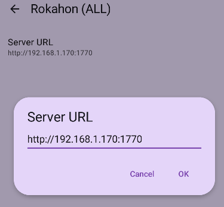

# Rokahon

<p align="center">
  
</p>

Rokahon (or ローカル本) is a simple server for your local gallery, you can
browse local files through apps similar to Mihon or use it as a simple REST
server.

## Rokahon server

A very basic server that exposes your local gallery.

For example, with the configuration..

```json
{
  "VERSION": "0.2.1",
  "PORT": 1770,
  "CACHE": true,
  "LIBRARY_ROOT": [
    "path/to/lib1",
    "other/lib2"
  ]
}
```

Rokahon will serve any subdirectory that follows the structure
`title > chapters > pages` located at `path/to/lib1` and `other/lib2`.

```
path/to/lib1/..
   bookTitle
     chapter2
       1.ext
       ..
     chapter1
       1.ext
       2.ext
       ..

other/lib2/..
   bookTitle
     chapter2
       a.ext
       ..
     chapter1
       a.ext
       ..
```

## Rokahon Mihon Extension

Rokahon android extension that works with most Tachiyomi forks, including Mihon.

Simply launch the server, install the extension, configure the address and you
are done.

<p align="center">
  
</p>
